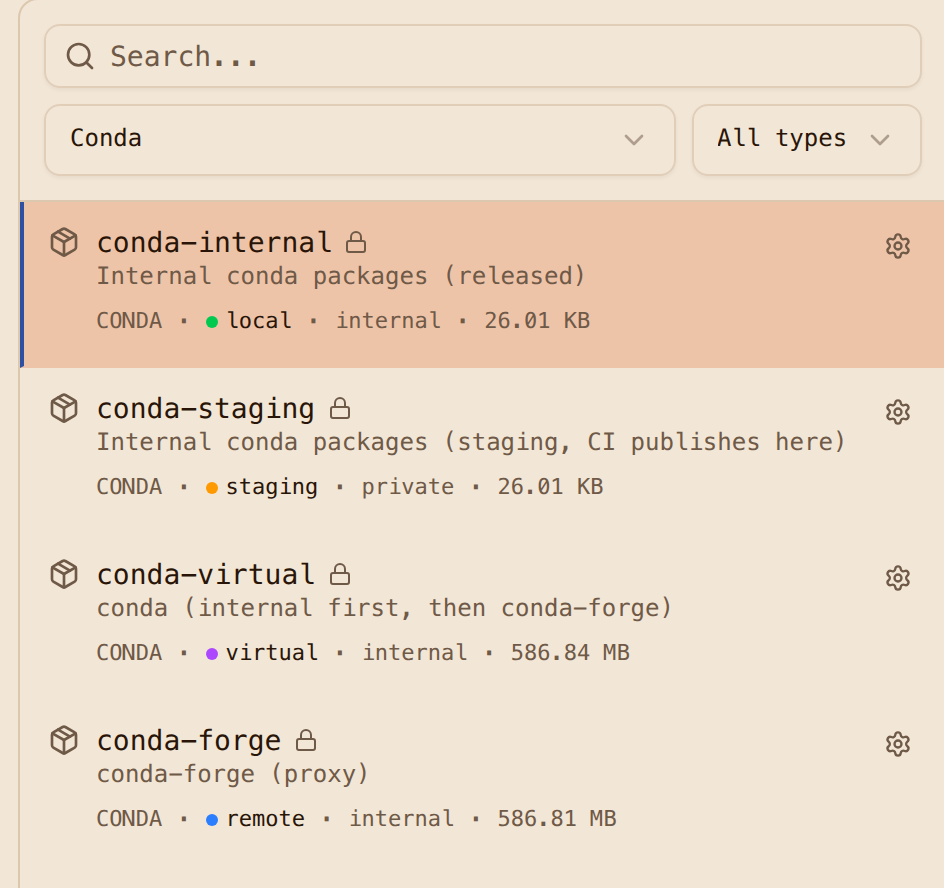
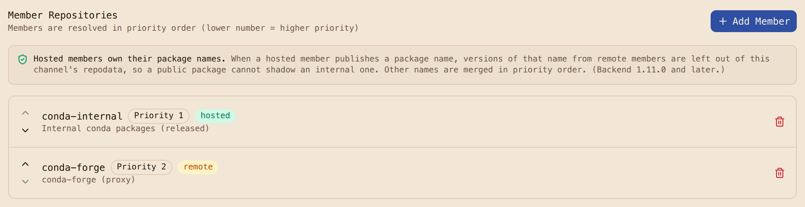

# Step 1: Stand up the registry

The registry runs as its own compose project, `ak-conda`, on a user-defined podman network. Two
decisions here shape everything after, so they come first.

**The registry has a bare hostname and TLS.** Clients reach it as `https://ak.internal`, on port
443 inside the network, with a certificate from Caddy's internal CA. There are two reasons. pixi
looks credentials up by hostname and drops the port, so `pixi auth login host:8443` stores an
entry that is never sent (we confirmed this on the wire). And a security team will not accept
credentials over plain HTTP, so the walkthrough does not either. The CA certificate is exported to
`registry/out/ak-internal-ca.crt` and every client container trusts it.

**Clients are containers on the registry's network.** Every pixi and rattler-build step runs in a
container attached to `ak-conda-net`, where `ak.internal` resolves because the Caddy container
carries that network alias. A second network, `build-isolated`, is marked `internal: true`, so it
has no route anywhere; Caddy is on it too. That is the network the registry-only proofs run on.
The only host port is `127.0.0.1:30444`, for you and for screenshots.

```console
$ registry/up.sh
up.sh: generating .../registry/.env
 ...
 Container ak-conda-caddy Started
up.sh: waiting for Caddy's internal CA  .../registry/out/ak-internal-ca.crt
up.sh: waiting for https://ak.internal:30444/readyz . ready
```

Cold start, pulls included, is about 90 seconds. From the host, the scripts talk to the registry
by its real name with `curl --resolve ak.internal:30444:127.0.0.1 --cacert registry/out/ak-internal-ca.crt`,
so SNI, the Host header and certificate verification are exactly what a client on the network
sees. No `/etc/hosts` edit.

A few compose details, all in
[`registry/compose/compose.override.yml`](https://github.com/artifact-keeper/walkthroughs/blob/main/private-conda-channel-pixi/registry/compose/compose.override.yml):
containers are renamed `ak-conda-*` so two projects can share a host, Postgres and OpenSearch
publish no ports, and `BACKEND_IMAGE` / `WEB_IMAGE` in `registry/.env` pick the images.

## The channels

[`registry/bootstrap.sh`](https://github.com/artifact-keeper/walkthroughs/blob/main/private-conda-channel-pixi/registry/bootstrap.sh)
creates everything through the API and can be re-run; the second run reports each object as
existing.

| Repository | Format | Type | Visibility | Purpose |
|---|---|---|---|---|
| `conda-forge` | conda | remote | internal | proxy of `https://conda.anaconda.org/conda-forge` |
| `conda-staging` | conda | staging | private | where CI publishes; release target is `conda-internal` |
| `conda-internal` | conda | hosted | internal | released internal packages; `promotion_only`, so direct uploads are refused |
| `conda-virtual` | conda | virtual | internal | `conda-internal` at priority 1, `conda-forge` at priority 2; the one channel consumers use |
| `pypi-remote` | pypi | remote | internal | so mixed conda and PyPI projects resolve through the registry too |
| `oci-ghcr`, `oci-redhat` | docker | remote | internal | proxies for the pixi and UBI base images |
| `oci-apps` | docker | hosted | internal | the application images we build |
| `trust` | generic | hosted | public | the CA certificate and the attestation public key |

`visibility: internal` means any authenticated user can read; anonymous requests get 401. The
staging repository is `private`, so a consumer cannot even see that it exists.

The bootstrap also turns on scan-on-upload for both hosted channels and creates the scan policy
that gates promotion; [Step 4](4-promote-with-gates.md) covers it.

## Tokens

Three tokens, each doing one job:

- `ci.token`: a repository token on `conda-staging`, read and write, 90 days. CI can publish to
  staging and nowhere else.
- `consumer.token`: a user token with `read:artifacts` and a repository selector covering
  `conda-virtual`, `conda-internal`, `conda-forge`, `pypi-remote` and the image proxies. This is
  what developers and builds use.
- A repository token on `conda-virtual` alone, read only, kept to show a limitation (below).

What each credential can read, as HTTP status per repository
([`gates/token-matrix.sh`](https://github.com/artifact-keeper/walkthroughs/blob/main/private-conda-channel-pixi/gates/token-matrix.sh)):

```text
credential     conda-internal conda-staging conda-forge conda-virtual pypi-remote trust
anon           401 401 401 401 401 200
ci             404 200 404 404 404 200
consumer       200 404 200 200 200 200
consumer-repo  404 404 404 404 404 200
```

Two things worth knowing. A repository that a token cannot see answers 404, not 403, so its
existence is not disclosed. And **a repository token scoped only to the virtual repository cannot
read through it**: member reads are authorized against the member, so the virtual channel answers
`404 Virtual repository has no accessible members`. Consumers therefore need a token whose scope
covers the members, which is what `consumer.token` is. We have asked for this to be reconsidered;
until then, scope consumer tokens to the members.





Next: [Step 2, configure pixi](2-configure-pixi.md).
