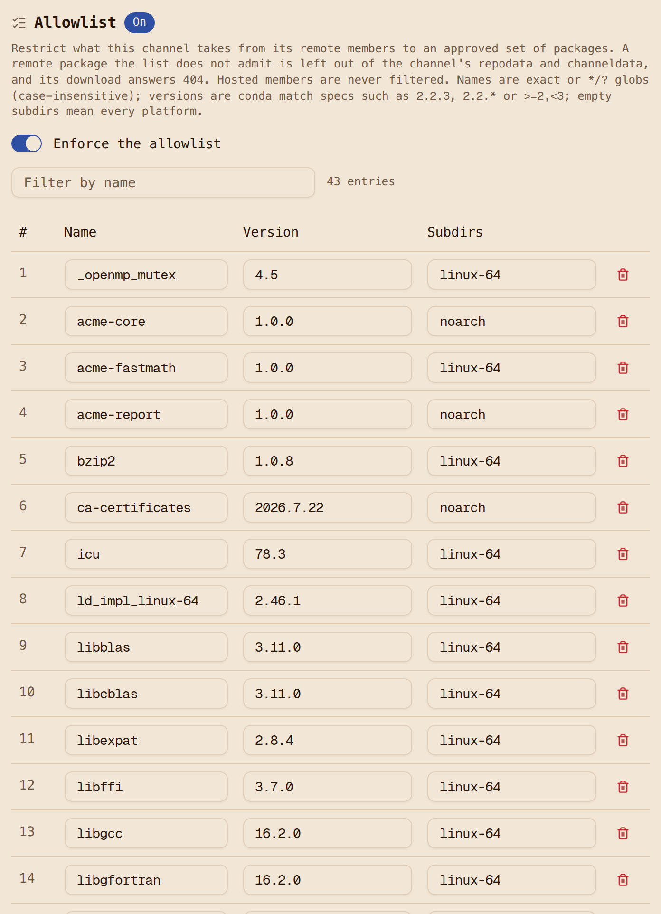

# Step 10: Allowlist what comes from conda-forge

Up to this point `conda-virtual` offers everything conda-forge has, which on the day of this
run was 790,754 linux-64 records. The name rule from [Step 5](5-resolve-through-one-channel.md)
stops conda-forge from shadowing one of our own package names, but every other public package
is one `pixi add` away from any developer. For a lot of teams that is fine. For the teams this
walkthrough is written for, it is the first question an auditor asks: can someone install a
package nobody approved? This step makes the answer no. The virtual channel gets an allowlist,
and the allowlist is the project's own `pixi.lock`.

We chose the lockfile as the source of the list rather than a hand-kept approved-packages page
because the lock already is the approved list. Every package in it was solved, reviewed in a
pull request and installed in CI. Keeping a second list in step with it by hand is the kind of
work that stops happening after a month. Reading it from the lock means the list is always
exactly what the project uses, no more and no less.

What the allowlist does (Artifact Keeper
[#4576](https://github.com/artifact-keeper/artifact-keeper/issues/4576)):

- It lives on the **virtual** repository and applies to the records its **remote** members
  contribute. Hosted members (`conda-internal`) are never filtered; they are curated by promotion
  ([Step 4](4-promote-with-gates.md)), which is a stronger control than a name list.
- An entry is a package name (exact or a glob), an optional conda version spec and optional
  subdirs. A bare version such as `3.12.14` means exactly that version. Builds are not part of
  the match, so every build of an admitted version is admitted.
- It is enforced in two places that always agree: the index (`repodata.json`, `.zst`, `.bz2` and
  `channeldata.json`) and the download path. A package that is not admitted is simply not in the
  repodata, so the solver reports it as not found, and its file is 404 through the virtual
  channel even when the proxy already has it cached. This matters: a download-only block (the
  remote repository's upstream filter, which exists too) lets the solver pick a package and then
  fails the install halfway through, which is the failure mode that makes people turn controls off.
- `enabled` is explicit. Enabled with no entries admits nothing from conda-forge; disabled keeps
  the entries and serves the full merge, so you can turn the list off for a solve and back on
  without losing it.

## Set it from the lock

[`allowlist/from-lock.sh`](https://github.com/artifact-keeper/walkthroughs/blob/main/private-conda-channel-pixi/allowlist/from-lock.sh)
reads the `- conda:` entries of `project/pixi.lock`, takes the name and version from each file
name and the subdir from its URL, and `PUT`s one entry per package with `enabled: true`. The
request replaces the whole list, so running it again after `pixi lock` is all it takes to follow
the lock.

```console
$ make allowlist
allowlist/from-lock.sh
allowlist: 43 entries from project/pixi.lock (linux-64 31, noarch 12)
allowlist: PUT /api/v1/repositories/conda-virtual/allowlist -> HTTP 200 {"enabled":true,"entry_count":43}
allowlist/show.sh
conda-virtual: enabled=true entries=43
  _openmp_mutex      4.5          linux-64
  acme-core          1.0.0        noarch
  acme-fastmath      1.0.0        linux-64
  acme-report        1.0.0        noarch
  bzip2              1.0.8        linux-64
  ...
```

The request body, one entry per locked conda package:

```json
{
  "enabled": true,
  "entries": [
    {"name": "_openmp_mutex", "version": "4.5", "subdirs": ["linux-64"]},
    {"name": "numpy", "version": "2.5.3", "subdirs": ["linux-64"]},
    {"name": "python-dateutil", "version": "2.9.0.post0", "subdirs": ["noarch"]},
    ...
  ]
}
```

The three `acme-*` entries are in the list because they are in the lock. They make no
difference, because hosted records are never filtered.

## What the channel serves now

```text
noarch/repodata.json: x-ak-allowlist-dropped: 382366
noarch: 22 records (17 from the remote covering 10 name/version pairs, 5 hosted); lock: 12 files
linux-64/repodata.json: x-ak-allowlist-dropped: 790523
linux-64: 231 records (230 from the remote covering 30 name/version pairs, 1 hosted); lock: 31 files
channeldata.json: x-ak-allowlist-dropped: 34585
channeldata.json: 43 names; colorama listed: 0
```

linux-64 goes from 790,754 records to 231. The remote part is exactly the lock's 30 linux-64
name/version pairs. It is 230 records rather than 30 because each version has several builds
(`numpy 2.5.3` for every Python, for example). The `X-AK-Allowlist-Dropped` response header
says how many records the list left out, which is a useful number to graph. The `.json`, `.zst`
and `.bz2` encodings decode to the same document, so there is no second index to slip through.

A side effect we did not plan for: the index shrank from 458 MB to a few kilobytes, so every
solve through the channel got faster too. The [scenarios](scenarios.md) measure that.

## A package outside the lock

`colorama` is on conda-forge and not in the lock:

```text
GET /conda/conda-forge/noarch/colorama-0.4.6-pyhd8ed1ab_1.conda  200   (the remote itself is not filtered)
GET /conda/conda-virtual/noarch/colorama-0.4.6-pyhd8ed1ab_1.conda  404  {"code":"NOT_FOUND","message":"Artifact not found in any member repository"}
```

The 404 is the same one the virtual channel gives for a package no member has, so a client
cannot tell a blocked package from a nonexistent one. Asking pixi for it, in a copy of the
project:

```console
$ pixi add --no-install colorama      # allowlist on
Error:   × failed to solve requirements of environment 'default' for platform 'linux-
  │ 64'
  ├─▶   × failed to solve the environment
  │   
  ╰─▶ Cannot solve the request because of: No candidates were found for
      colorama *.
```

Not found, at solve time. That is the behaviour we wanted: the same message a developer gets
for a typo, and nothing half-installed.

## The project still installs

```console
$ NETWORK=build-isolated project/pixi-run.sh install --locked      # cold cache
The default environment has been installed.
```

```text
conda-virtual requests during install: 41 (40 package downloads 200, 0 other than 200/304)
```

Forty conda-forge packages through the allowlisted channel, the three `acme-*` packages from
`conda-internal`, and `humanize` from `pypi-remote`.

## Turn it off

```console
$ make allowlist-off
allowlist/off.sh
allowlist: PUT /api/v1/repositories/conda-virtual/allowlist -> HTTP 200 {"enabled":false,"entry_count":43}
```

```text
allowlist off: colorama download HTTP 200; linux-64 records 790754; channeldata 34628 names, colorama listed: true
$ pixi add --no-install colorama      # allowlist off
Added colorama >=0.4.6,<0.5
```

`off.sh` keeps the entries and sets `enabled: false`; `off.sh --delete` removes the list. Every
change lands in the audit log as `REPOSITORY_ALLOWLIST_CHANGED` with the previous and current
`enabled` and `entry_count`, so "who opened the channel up, and when" is one query.

## Keeping the list current

The list follows the lock, so the question becomes how the lock changes. The answer we settled on
is the normal pull-request flow: a change to `pixi.toml` is solved against an unfiltered twin of
the channel, the resulting lock is reviewed, and on merge a CI job applies the allowlist from it.
That job exists and is exercised in [scenario S6](scenarios.md#s6-allowlist-from-a-pull-request),
including what a package removed from the lock looks like afterwards.

## What to notice

- The allowlist binds `conda-virtual`, not `conda-forge`. In the version this walkthrough was
  first written against, the consumer token could still read the `conda-forge` proxy directly,
  so a developer who added `-c conda-forge` got past the list. Artifact Keeper 1.11.0 closes
  that: a token scoped to a virtual channel reads its members only through the virtual
  ([#4559](https://github.com/artifact-keeper/artifact-keeper/issues/4559)), so consumers get
  the one channel and nothing else.
- Builds are not matched. A lock pins one build; the allowlist admits every build of that
  version. We think that is right, because the lock already pins the build, and a list that
  pinned builds would need re-applying on every rebuild of the same version.
- The gate ([`gates/g14-allowlist.sh`](https://github.com/artifact-keeper/walkthroughs/blob/main/private-conda-channel-pixi/gates/g14-allowlist.sh))
  turns the allowlist off when it finishes, because the rest of the demo runs with it off.
- The console has an editor for the list, with import from a lockfile, in artifact-keeper-web
  1.11.0 ([#971](https://github.com/artifact-keeper/artifact-keeper-web/issues/971)). The API is
  what CI should use.



Now the [results](results.md), and then the [scenarios](scenarios.md), which put an artifact
manager in front of all of this and break things on purpose.
