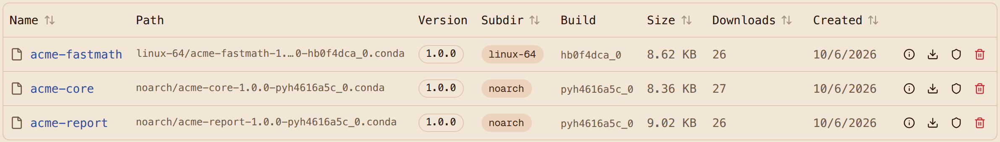

# Step 3: Build, publish and attest internal packages

## Build with rattler-build

Three recipes in
[`packages/recipes/`](https://github.com/artifact-keeper/walkthroughs/tree/main/private-conda-channel-pixi/packages/recipes),
in rattler-build's `recipe.yaml` format:

| Package | Kind | Notes |
|---|---|---|
| `acme-core` | `noarch: python` | a small library; the version comes from `ACME_CORE_VERSION` so later steps can build 1.0.1, 1.1.0 and a hostile 99.0.0 |
| `acme-fastmath` | `linux-64`, C | a shared library and a CLI built with `${{ compiler('c') }}`; exercises a real subdir and pulls a C toolchain through the proxy |
| `acme-report` | `noarch: python` | depends on `acme-core >=1.0,<2`, `pandas >=2`, `rich >=13`; ships the `acme-report` entry point |

[`packages/build.sh`](https://github.com/artifact-keeper/walkthroughs/blob/main/private-conda-channel-pixi/packages/build.sh)
runs `rattler-build build --recipe-dir /recipes -c conda-forge` in the client container on the
registry network. `-c conda-forge` is the canonical name; the system config mirrors it to the
registry, so rattler-build itself, Python, pip, setuptools and the compiler all came through
`https://ak.internal/conda/conda-forge`. All three packages build and pass their recipe tests in
about 23 seconds with a warm cache.

## Publish with a PUT

Publishing is `rattler-build upload artifactory --url https://ak.internal/conda --channel conda-staging <file>`
with the CI token in `RATTLER_AUTH_FILE`. The "artifactory" target is the one generic enough to
use: it does a plain `PUT /conda/<repo>/<subdir>/<file>` with the raw package as the body and a
Bearer header. Artifact Keeper accepts exactly that.

```text
PUT /conda/conda-staging/linux-64/acme-fastmath-1.0.0-hb0f4dca_0.conda  201
PUT /conda/conda-staging/noarch/acme-core-1.0.0-pyh4616a5c_0.conda      201
PUT /conda/conda-staging/noarch/acme-report-1.0.0-pyh4616a5c_0.conda    201
```

Publishing the same file again:

```text
HTTP status client error (409 Conflict) for url (.../conda-staging/noarch/acme-core-1.0.0-pyh4616a5c_0.conda)
```

That 409 is the immutability requirement. A file name, once published, cannot be replaced with
different bytes, and since 1.11.0 a withdrawn file name cannot be reused either. Rollback is a new
version, or repointing, never an overwrite. rattler-build prints nothing on success with
`--log-style plain`, so scripts check the exit code.

The registry also checks the upload against the package itself: the `subdir` in the package's
`index.json` must match where it is being published, so a linux-64 build cannot be filed under
`noarch` by a wrong URL or a missing header.

## Attest with your own key

CEP-27 is the conda ecosystem's publish attestation: an in-toto statement saying "this package,
with this digest, was published to this channel," wrapped in a Sigstore bundle. Public registries
expect the bundle to come from a GitHub Actions identity through the public Sigstore
infrastructure. A regulated shop often cannot use public Sigstore, so this walkthrough signs with
its own key, and in [Step 7](7-verify-attestations.md) the registry is configured to trust that
key. The GitHub Actions keyless path works unchanged if you prefer it.

[`packages/attest.sh`](https://github.com/artifact-keeper/walkthroughs/blob/main/private-conda-channel-pixi/packages/attest.sh)
writes the statement and signs it:

```console
$ cosign attest-blob --key signing/keys/cosign.key --statement acme-core-1.0.0-pyh4616a5c_0.conda.statement.json \
    --use-signing-config=false --tlog-upload=false --bundle acme-core-1.0.0-pyh4616a5c_0.conda.sigstore.json --yes
$ curl -sS --cacert ca.crt -H "Authorization: Bearer $CI_TOKEN" -X PUT \
    --data-binary @acme-core-1.0.0-pyh4616a5c_0.conda.sigstore.json \
    https://ak.internal/conda/conda-staging/noarch/acme-core-1.0.0-pyh4616a5c_0.conda/attestation
{"attestation_count":1,"attestations_sha256":"a40c9cfc...","status":"attestation stored",
 "verification":{"method":"sigstore-key","identity":"ci","state":"verified","statement_type":"https://in-toto.io/Statement/v1",...}}
```

Two cosign details cost us time, so they are written down:

- `cosign attest-blob --predicate ... --type ...` wraps the predicate in an in-toto Statement
  **v0.1**. CEP-27 specifies Statement v1. The script builds the v1 statement itself (subject name
  is the file name, digest is the file's sha256, predicate type
  `https://schemas.conda.org/attestations-publish-1.schema.json`) and passes it with
  `--statement`. The registry accepts both versions, but v1 is the specified one.
- cosign 3 refuses `--tlog-upload=false` on its own; add `--use-signing-config=false`. The result
  is a v0.3 bundle with a DSSE envelope and a public-key hint, and no transparency-log entry,
  which is what an on-premises signing setup produces.

The registry verifies the bundle at upload: the DSSE signature against a configured trusted key,
the subject digest against the stored package, the predicate type. A bundle it cannot verify is
refused with a 400 and nothing is stored. The three packages are now in staging, attested, and
waiting for promotion.



Next: [Step 4, promote with gates](4-promote-with-gates.md).
