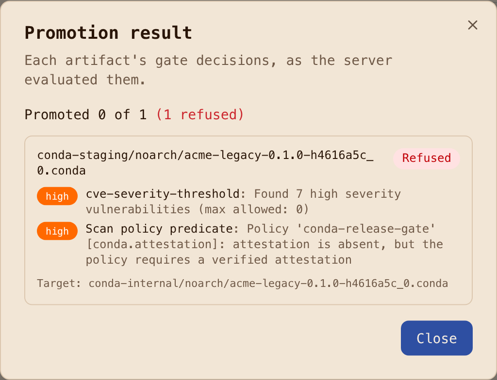
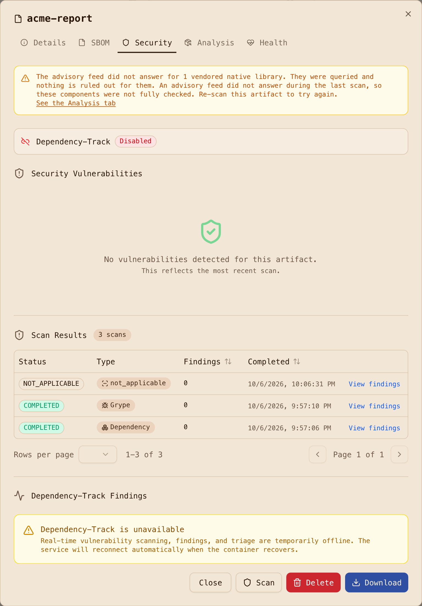

# Step 4: Promote with gates

Consumers never read `conda-staging`. What they read is `conda-internal`, and the only way into it
is promotion, which the registry gates. The gate is a scan policy on the **source** repository,
created by the bootstrap as `conda-release-gate` on `conda-staging`:

- `max_severity: high` and `block_unscanned: true`: a package with a High vulnerability, or no
  completed scan, does not move.
- conda predicates: `min_attestation_state: verified`, denied license families `gpl`, `agpl`,
  `lgpl` (and the specific `GPL-3.0-only`, `GPL-3.0-or-later`, `AGPL-3.0-only`), and
  `block_install_scripts: true`.

Scan-on-upload is on for both hosted channels, so every package in staging has a Grype result
within about 30 seconds of arriving. (Trivy reports conda packages as not applicable; Grype and
the registry's dependency scanner do the work.)

## What gets refused

Two deliberately bad packages live in
[`packages/recipes-negative/`](https://github.com/artifact-keeper/walkthroughs/tree/main/private-conda-channel-pixi/packages/recipes-negative):
`acme-legacy` vendors an old `urllib3` with seven High CVEs, and `acme-copyleft` declares
`GPL-3.0-only`. A third case is a clean package that nobody attested. Promotion answers each with
the rule that stopped it:

```text
gate cve-severity-threshold: FAILED (Found 7 high severity vulnerabilities (max allowed: 0))
gate policy-predicate:       FAILED (Policy 'conda-release-gate' [conda.license]: declared license 'gpl-3.0-only' is denied;
                                     [conda.license_family]: declared license family 'gpl' is denied)
gate policy-predicate:       FAILED (Policy 'conda-release-gate' [conda.attestation]: attestation is absent,
                                     but the policy requires a verified attestation)
```

The response carries `gate_results`, one entry per rule with `passed` and a reason, so the
decision is auditable and the UI can show it rule by rule rather than as one red toast.



## What gets through

The three attested, clean packages promote:

```text
promote: noarch/acme-core-1.0.0-pyh4616a5c_0.conda      -> conda-internal: HTTP 200 promoted=true
promote: linux-64/acme-fastmath-1.0.0-hb0f4dca_0.conda   -> conda-internal: HTTP 200 promoted=true
promote: noarch/acme-report-1.0.0-pyh4616a5c_0.conda    -> conda-internal: HTTP 200 promoted=true
```

The promoted record in `conda-internal` keeps everything the solver needs and gains the two
fields the registry adds:

```json
"acme-report-1.0.0-pyh4616a5c_0.conda": {
  "build": "pyh4616a5c_0", "depends": ["python >=3.10", "acme-core >=1.0,<2", "pandas >=2", "rich >=13", "python"],
  "md5": "3d3b34db...", "sha256": "...", "license": "Apache-2.0", "noarch": "python",
  "attestations_sha256": "b5ba0b8a...", "indexed_timestamp": 1791381108494 }
```

The attestation follows the package: the `.sigs` sidecar is served from `conda-internal` with the
same bytes that were verified in staging. Promotion moves rather than copies, so staging lists the
file under `removed` afterwards.

One detail that matters to an auditor: promotion keeps the package's origin. A package promoted
from staging shows as hosted, originally uploaded to `conda-staging` by the CI token, and the
promotion itself is in the promotion history with its gate results.



Next: [Step 5, resolve through one channel](5-resolve-through-one-channel.md).
