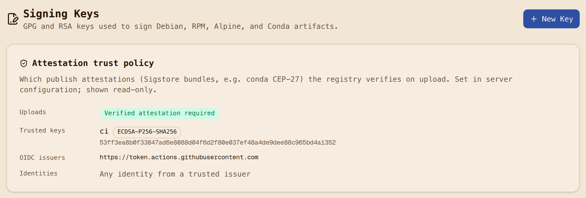
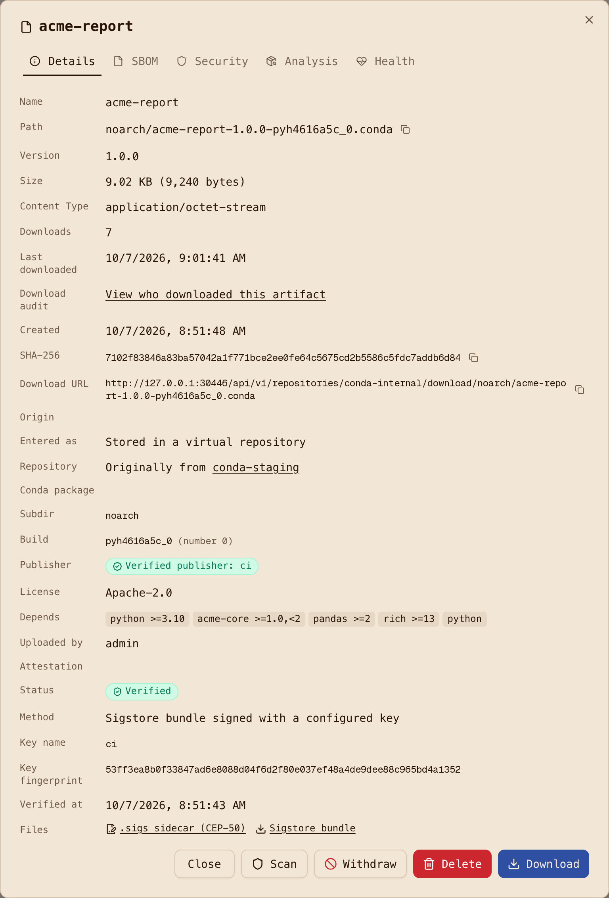

# Step 7: Verify attestations

Two parties verify: the registry when a package is published, and the consumer before a package
is linked into an environment. Both read the same material.

## What the registry serves (CEP-50)

For every attested package, the registry serves the Sigstore bundle as a sidecar next to the
package, content-addressed and append-only:

```text
GET /conda/conda-internal/noarch/acme-report-1.0.0-pyh4616a5c_0.conda.sigs                 200
GET /conda/conda-internal/noarch/acme-report-1.0.0-pyh4616a5c_0.conda.sigs.<sha256>        200
```

and the record in repodata carries `attestations_sha256`, the digest of that sidecar. Sidecars
follow the repository's read rules, so anyone who can read the package can read its attestation.
Append-only means a second attestation (say, from a second signer) is added, not substituted.

## The trust policy

The registry's policy is configuration, read back from `GET /api/v1/attestations/policy`:

```json
{"require_verified": true,
 "issuers": ["https://token.actions.githubusercontent.com"],
 "identities": [],
 "keys": [{"id": "53ff3ea8b0f33847", "name": "ci", "fingerprint": "53ff3ea8...", "algorithm": "ecdsa-p256-sha256"}]}
```

- `CONDA_ATTESTATION_PUBLIC_KEYS=ci=/keys/cosign.pub`: a key-based bundle is verified against this
  key, with no transparency log required. This is the on-premises path.
- `CONDA_ATTESTATION_ISSUERS` and `CONDA_ATTESTATION_IDENTITIES`: for keyless bundles, which OIDC
  issuers and which identities (workflow paths, for GitHub Actions) are trusted. The default
  trusts the GitHub Actions issuer.
- `require_verified`: an attestation upload that does not verify is refused with 400 and nothing
  is stored. With it off, unverified attestations are stored and marked.



A bundle signed with a key that is not configured is refused:

```text
HTTP 400 bundle is signed by key hint wiEcltjl..., which is not a configured trusted key
```

The stored verification record says how a package was verified, and the UI shows it on the
package: method, key name and fingerprint (or identity and issuer for keyless), verification time,
and links to the sidecar and the bundle.



## What the consumer verifies

[`image/verify-attestations.sh`](https://github.com/artifact-keeper/walkthroughs/blob/main/private-conda-channel-pixi/image/verify-attestations.sh)
runs in the builder after `pixi install --locked` and before anything else. For every package in
`pixi.lock` that came from the internal channel, it fetches the `.sigs` sidecar and the package,
and runs:

```console
$ cosign verify-blob --key /etc/acme/conda-ci-cosign.pub --bundle <file>.sigs --insecure-ignore-tlog <file>
```

then checks that the statement's subject digest is the file's sha256 and that the predicate's
target channel is the channel the lock says the package came from. Any failure fails the build:

```text
verify: 3 package(s) from https://ak.internal/conda/conda-internal/; trusted key f3751a577f375056
PASS acme-fastmath-1.0.0-hb0f4dca_0.conda (sidecar, sha256 365a421b75d1..., channel https://ak.internal/conda/conda-internal)
PASS acme-core-1.0.0-pyh4616a5c_0.conda (sidecar, ...)
PASS acme-report-1.0.0-pyh4616a5c_0.conda (sidecar, ...)
verify: attestation gate passed for 3 package(s)
```

The gate's failure cases are exercised in [Step 9](9-prove-it-fails-safely.md): a flipped byte,
a tampered file re-locked with its new hash, a bundle from the wrong key, and a package with no
sidecar all fail with distinct messages.

Why a script and not pixi itself: rattler (the library under pixi) gained install-time
attestation verification in September 2026, with `require` and `warn` modes and an identity
policy, but pixi 0.81 does not yet enable it and has no setting for it. Until it does, the
verification step belongs in the build, and `cosign verify-blob` with the registry's sidecars is
the same check. When pixi exposes rattler's verification, this script becomes one line of config.

Next: [Step 8, SBOM and blast radius](8-sbom-and-blast-radius.md).
