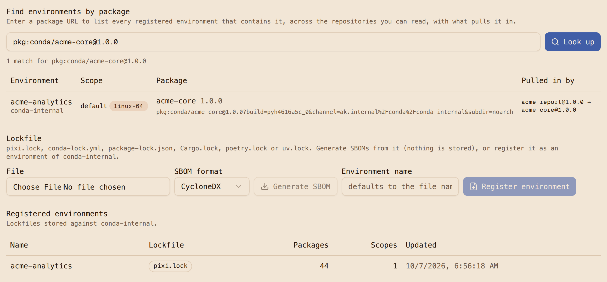
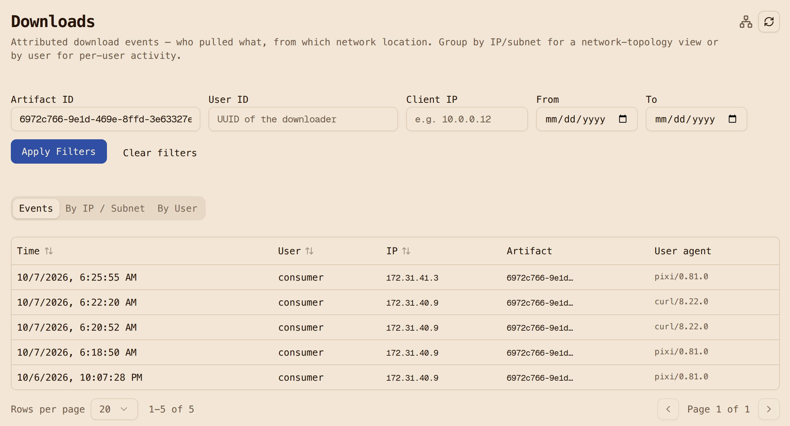

# Step 8: SBOM and blast radius

Three views of the same environment, and the question they are there to answer: when the next
`openssl` advisory lands, which of our deployments contain it?

## Scan the image

[`scan/scan.sh`](https://github.com/artifact-keeper/walkthroughs/blob/main/private-conda-channel-pixi/scan/scan.sh)
runs Syft and Grype against the built image and against the installed environment:

```text
== image localhost/acme-analytics:1.0.0
  syft packages by type: {"binary":3,"conda":43,"python":12,"rpm":22}
  grype matches by severity: {"High":16,"Low":23,"Medium":67,"Negligible":2}
  High openssl 3.6.4 CVE-2026-54873 fix=3.4.8,3.5.9,3.6.5,4.0.3
  High openssl 3.6.4 CVE-2026-72897 fix=3.4.8,3.5.9,3.6.5,4.0.3
  ...
  High python 3.12.14 CVE-2026-82049 fix=3.12.15,...
```

Two things to know about the tools. Syft needs `--select-catalogers +conda-meta-cataloger` to see
conda packages in an image at all, and it emits no PURL (package URL) for them, only CPEs; Grype
still matches by name and version, and reports each conda CVE twice, once for the conda record
and once for the binary it finds in `bin/`. Trivy produces an SBOM and licenses for conda
environments but does not scan them for vulnerabilities. The 22 RPM packages are UBI micro's own.

The four High `openssl` findings are the cooldown from [Step 5](5-resolve-through-one-channel.md)
showing up where you would expect: the fix, 3.6.5, was under 14 days old at lock time. That is a
decision for the team, not a bug, and the lock makes it visible.

## The registry's SBOM from the lockfile

The registry builds a CycloneDX or SPDX SBOM straight from `pixi.lock`, with proper conda PURLs:

```console
$ curl -sS --cacert ca.crt -H "Authorization: Bearer $TOKEN" \
    -X POST "https://ak.internal/api/v1/sbom/environment?filename=pixi.lock" --data-binary @project/pixi.lock
{"lockfileFormat":"pixi.lock","sbomFormat":"cyclonedx","summary":{"distinctPackages":44,"edges":99},"components":44}
```

```text
pkg:conda/acme-fastmath@1.0.0?build=hb0f4dca_0&channel=ak.internal%2Fconda%2Fconda-internal&subdir=linux-64
```

44 components for 44 locked packages, each with build, channel, subdir and sha256. Lock format 7
does not carry name and version fields, so this is the tool that parses them out reliably.

## Register the environment, then ask the question

Registering the lockfile against a repository
(`POST /api/v1/repositories/conda-internal/environments?filename=pixi.lock`) stores the
environment and its dependency graph. The reverse lookup then answers by PURL:

```console
$ curl ... "https://ak.internal/api/v1/environments/lookup?purl=pkg:conda/openssl@3.6.4"
[{"repository":"conda-internal","environment":"acme-analytics","path":["acme-report@1.0.0","python@3.12.14","openssl@3.6.4"]}]
$ curl ... "...lookup?purl=pkg:pypi/humanize@4.16.0"
[{"repository":"conda-internal","environment":"acme-analytics","path":["humanize@4.16.0"]}]
```

The answer includes the inclusion path, so the incident response is "`acme-analytics` has it
through `python`," not a grep across repositories. Register every deployed lockfile and this is
your blast-radius query. The UI has the same lookup on the repository's Environments tab, with
SBOM download and generate-from-lockfile beside it.



## The download audit

Every pull of a hosted package is recorded with the credential that made it, so the question
"who installed `acme-report 1.0.0` and when" has an answer in the Downloads view, deep-linked
from the package. One honest gap: pulls served through the conda-forge and PyPI proxies are not
yet recorded as download events, so the audit covers internal packages and not the public ones a
build also fetched. That is filed and queued for a later release because it needs a schema change.



Next: [Step 9, prove it fails safely](9-prove-it-fails-safely.md).
