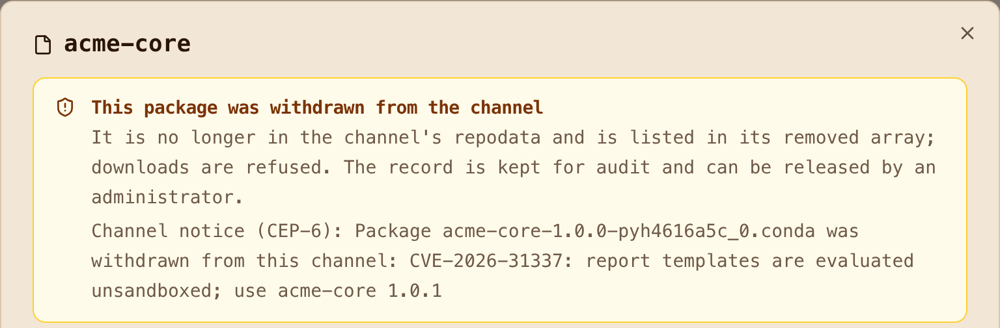

# Step 9: Prove it fails safely

A supply-chain story is only as good as its failures. The gates in
[`gates/`](https://github.com/artifact-keeper/walkthroughs/tree/main/private-conda-channel-pixi/gates)
run every one of these on each `make gates`, against scratch repositories so the demo channels
stay clean.

## The dependency-confusion attempt

[`gates/fake-upstream.sh`](https://github.com/artifact-keeper/walkthroughs/blob/main/private-conda-channel-pixi/gates/fake-upstream.sh)
builds `acme-core 99.0.0`, indexes it into a static channel, serves it on the network, and creates
a remote repository pointing at it (the backend only allows that one private address as an
upstream, through `AK_SSRF_ALLOW_PRIVATE_CIDRS`; without it, a private upstream is refused). A
virtual channel with the internal channel at priority 1 and the fake upstream at priority 2 then
has to choose.

```text
versions of acme-core offered by the virtual channel:  ["1.0.0"]
unpinned solve of acme-core:                            1.0.0
```

The 99.0.0 is not offered at all, because `conda-internal` owns the name. Before this rule, the
same test offered `["1.0.0", "99.0.0"]` and an unpinned solve picked 99.0.0. The client-side pin
from [Step 2](2-configure-pixi.md) would have held either way; the point is that it no longer has
to.

## Overwrite

```text
PUT .../conda-staging/noarch/acme-core-1.0.0-pyh4616a5c_0.conda   409 Conflict
```

The same file name with different bytes is refused. Since 1.11.0, a withdrawn name is refused too
("already exists and is immutable"), so the gates mint a fresh version per run.

## Tampering and the wrong key

Against a channel of signed packages, the container build's gate:

```text
PASS  signed package
FAIL  flipped byte:            sha256 6248c5a8... != pixi.lock eb370de6...
FAIL  re-locked tampered file: statement does not bind this file
FAIL  wrong key:               accepted signatures do not match threshold, Found: 0, Expected 1
FAIL  unsigned package:        no CEP-50 sidecar
```

The second case matters: an attacker who can rewrite the lockfile to match a tampered package
defeats the hash check, but not the attestation, because the statement binds the original digest.

At the registry, an attestation signed with a key that is not in the trust policy:

```text
trusted key:  HTTP 201
wrong key:    HTTP 400 bundle is signed by key hint wiEcltjl..., which is not a configured trusted key
```

## Offline, and a second mirror

```console
$ pixi install --frozen --offline      # --network none, PIXI_CACHE_DIR pre-filled
 ✔ The default environment has been installed.
```

The same lock installs from a plain static-directory mirror after changing only `[mirrors]`, and a
package with one flipped byte on that mirror fails:

```text
hash mismatch when extracting ... expected eb370de6..., got 6248c5a8...
```

pixi checks the sha256 in the lock on every install, including when a package is reused from the
cache.

## A broken member

A virtual channel whose remote member points at a dead upstream:

```text
GET /conda/conda-virtual-g6/linux-64/repodata.json   502  member conda-broken-upstream: fetch failed
```

Not 200 with the member missing. See [Step 5](5-resolve-through-one-channel.md) for why.

## Withdrawal

Withdrawing a package from a channel (`DELETE /conda/<repo>/<subdir>/<file>` with a reason, admin
only) removes it from repodata, lists it under `removed`, and appends a CEP-6 notice to the
channel's `notices.json`, which conda clients display. Nothing is overwritten and the history
stays.



## Two limitations, stated

- `exclude-newer` in pixi 0.81 filters on the package's own build timestamp, so a backdated
  package gets past the cooldown. The registry's `indexed_timestamp` is there for rattler, which
  uses it; pixi will follow.
- Proxy downloads are not yet in the download audit ([Step 8](8-sbom-and-blast-radius.md)).

Now the [results](results.md).
