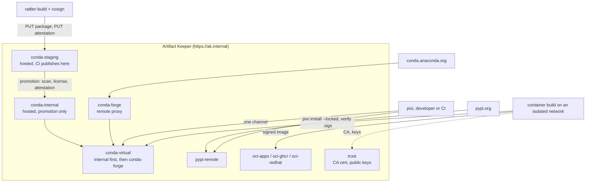

# A private conda channel for pixi, with supply-chain controls

This walkthrough builds a private conda channel that a security team would sign off on. One
registry, Artifact Keeper, proxies conda-forge, hosts your internal packages, and presents a
single channel to every developer and build. Every package is signed, every install verifies the
signature before anything is linked, builds run on a network with no route to the internet, and
the registry can tell you, for any package, which environments contain it.

Everything here runs in containers on one host. The code is in
[`private-conda-channel-pixi/`](https://github.com/artifact-keeper/walkthroughs/tree/main/private-conda-channel-pixi)
and `make all` reproduces the whole thing from an empty registry in about 15 minutes.

!!! note "Registry version"
    The walkthrough targets Artifact Keeper **1.11.0**. Several of the registry features it uses
    (the virtual channel's name-ownership rule, CEP-50 attestation sidecars, key-based attestation
    trust, server-set `indexed_timestamp`) were built for this walkthrough and ship in 1.11.0.
    On 1.10.x, `make all-main` runs the same steps with documented workarounds; the
    [lab notes](findings.md) record what differs.

## Who this is for

Platform and security teams at organizations that run Python and data science on conda, already
front everything with an artifact manager, and have to answer auditors. The questions they get
asked are specific: where did this package come from, who published it, was it verified before it
was installed, and can you prove the build used nothing else. The requirements below come from
what such teams have asked for in public, in registry and client issue trackers and in tooling
they have open-sourced. No single company is behind them.

## What you will be able to show

| | Requirement | Where |
|---|---|---|
| R1 | Credentials never appear in channel URLs, manifests or lockfiles; clients send them as a header from a credential store | [Step 2](2-configure-pixi.md) |
| R2 | Bearer tokens for reads and publishing; read-only, repository-scoped tokens for consumers | [Step 1](1-stand-up-the-registry.md) |
| R3 | Proxy, hosted and staging channels behind one virtual channel with predictable priority | [Step 1](1-stand-up-the-registry.md), [Step 5](5-resolve-through-one-channel.md) |
| R4 | Internal package names cannot be shadowed by the public proxy | [Step 5](5-resolve-through-one-channel.md), [Step 9](9-prove-it-fails-safely.md) |
| R5 | Correct repodata in every format pixi asks for, including sharded repodata | [Step 5](5-resolve-through-one-channel.md) |
| R6 | Proxy freshness on an admin-set TTL; a broken member fails loudly | [Step 5](5-resolve-through-one-channel.md) |
| R7 | Immutable artifacts, gated promotion, withdrawal with a channel notice, an audit of pulls | [Step 4](4-promote-with-gates.md), [Step 8](8-sbom-and-blast-radius.md), [Step 9](9-prove-it-fails-safely.md) |
| R8 | CEP-27 attestations served per CEP-50 and verified before linking | [Step 3](3-build-and-publish.md), [Step 7](7-verify-attestations.md) |
| R9 | A trust policy you control: your own signing key, or specific OIDC identities | [Step 7](7-verify-attestations.md) |
| R10 | A server-set `indexed_timestamp` so dependency cooldowns can be trusted | [Step 5](5-resolve-through-one-channel.md) |
| R11 | SBOM, PURLs, vulnerability and license scanning; a PURL-to-environments lookup | [Step 8](8-sbom-and-blast-radius.md) |
| R12 | Registry-only builds on a network with no internet; portable lockfiles; offline install | [Step 6](6-build-the-container.md), [Step 9](9-prove-it-fails-safely.md) |
| R13 | Everything in containers, TLS from an internal CA, a bare hostname | [Step 1](1-stand-up-the-registry.md) |
| R14 | Only approved conda-forge packages reach consumers; the project's lockfile is the allowlist | [Step 10](10-allowlist-the-lockfile.md) |

## The shape of it



Three internal packages stand in for yours: `acme-core` (a pure-Python library), `acme-fastmath`
(a compiled linux-64 package, so a real subdir is involved) and `acme-report` (depends on
`acme-core` plus `pandas` and `rich` from conda-forge). A consumer project pins them and adds one
PyPI dependency. The end product is a UBI micro container image running `acme-report`, built with
nothing but the registry reachable.

## Before you start

- A Linux host with rootless podman 5.x and `podman compose` (or docker-compose), skopeo, cosign
  3.x, curl, jq and GNU make. No sudo is needed anywhere.
- About 8 GB of free RAM for the registry stack and 10 GB of disk for images and package caches.
- The Rocky walkthrough's [environment page](../rocky-linux-image-mode-bare-metal/environment.md)
  covers the podman specifics; this walkthrough needs no KVM and no VM.

!!! tip "Run it yourself"
    ```bash
    git clone https://github.com/artifact-keeper/walkthroughs
    cd walkthroughs/private-conda-channel-pixi
    make all          # registry, keys, packages, publish, attest, promote, lock, image, scans
    make gates        # the fourteen checks, including the ones that must fail
    make screens-ready   # prints the UI address and where the admin password is
    ```
    `make all` takes about 14 minutes from an empty registry on a 24-core host, most of it pulling
    conda-forge metadata and base images for the first time.

## Steps

1. [Stand up the registry](1-stand-up-the-registry.md): a private network, TLS, a bare hostname, the channels and tokens.
2. [Configure pixi for registry-only use](2-configure-pixi.md): the credential store, mirrors, strict priority, cooldowns, pinned internal names.
3. [Build, publish and attest internal packages](3-build-and-publish.md): rattler-build, a plain PUT, cosign with your own key.
4. [Promote with gates](4-promote-with-gates.md): scan results, license rules and the attestation requirement decide what reaches the internal channel.
5. [Resolve through one channel](5-resolve-through-one-channel.md): the virtual channel, sharded repodata, name ownership, cooldowns.
6. [Build the container on an isolated network](6-build-the-container.md): pixi on UBI micro, verified before linking, signed and pushed.
7. [Verify attestations](7-verify-attestations.md): CEP-50 sidecars, the trust policy, what the registry checks and what the client checks.
8. [SBOM and blast radius](8-sbom-and-blast-radius.md): Syft and Grype, the registry's lockfile SBOM, the PURL lookup, the download audit.
9. [Prove it fails safely](9-prove-it-fails-safely.md): the dependency-confusion attempt, overwrite, tampering, wrong key, offline, withdrawal.
10. [Allowlist what comes from conda-forge](10-allowlist-the-lockfile.md): the lockfile is the allowlist; anything outside it is not found.

Then [Results](results.md) and [Next steps](next-steps.md). The [lab notes](findings.md) are the
unedited record every page is written from, and the [plan](plan.md) is the design we started with.
