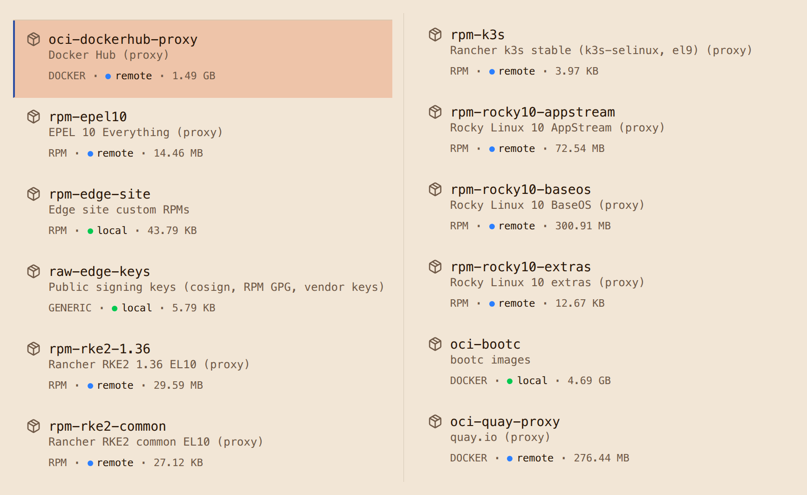

# Step 1: Stand up Artifact Keeper

Every later step reads from or writes to one Artifact Keeper instance, so it comes first. By
the end of this page you have the registry running, every repository the walkthrough uses,
and a first RPM of your own in a hosted repository.

**Make target:** `make registry-up`, which runs
[`registry/up.sh`](https://github.com/artifact-keeper/walkthroughs/blob/main/rocky-linux-image-mode-bare-metal/registry/up.sh) and then
[`registry/bootstrap.sh`](https://github.com/artifact-keeper/walkthroughs/blob/main/rocky-linux-image-mode-bare-metal/registry/bootstrap.sh).

## Start the stack

Artifact Keeper ships a `docker-compose.yml` that brings up Postgres, OpenSearch, the Rust
backend, the Next.js web UI, and a Caddy front door on port 30080. The proof of concept runs it
with rootless podman, and it serves requests about a minute after it starts. Three settings are
worth knowing about up front, because the rest of the walkthrough depends on them:

1. **Generate the secrets before the first start.** `JWT_SECRET` and `AK_WEBHOOK_SECRET_KEY`
   need real values. `up.sh` creates them with `openssl rand` and also sets
   `ADMIN_PASSWORD`, so the instance comes up ready to use with no interactive setup. Nobody
   should be typing passwords into a console as part of an automated deployment.
2. **Make the edge repositories public.** Repositories are private by default, which is the
   right default for a registry. Edge nodes need to read anonymously, so every repository in
   this walkthrough is created with `is_public: true`.
3. **The OCI registry is path-based.** Images live at `host:30080/<repo-id>/<image>:<tag>`,
   and the first path segment picks the repository. This is what lets one registry hold
   separate image repositories, each with its own policy.

When it is up, the web UI is at <http://localhost:30080> (user `admin`, password in
`registry/.env`).

## Create the repositories

Bootstrapping is a handful of `POST /api/v1/repositories` calls. Remote RPM repositories need
a concrete `baseurl` (mirrorlists are not supported), and Artifact Keeper generates the
`repodata` for hosted repositories itself, so there is no `createrepo` step. One remote RPM
repository and the hosted OCI repository look like this:

```bash
curl -X POST http://localhost:30080/api/v1/repositories \
  -H "Authorization: Bearer $TOKEN" -H 'Content-Type: application/json' \
  -d '{"key":"rpm-rocky10-baseos","name":"Rocky Linux 10 BaseOS (proxy)","format":"rpm",
       "repo_type":"remote","is_public":true,
       "upstream_url":"https://dl.rockylinux.org/pub/rocky/10/BaseOS/x86_64/os/"}'

curl -X POST http://localhost:30080/api/v1/repositories \
  -H "Authorization: Bearer $TOKEN" -H 'Content-Type: application/json' \
  -d '{"key":"oci-bootc","name":"bootc images","format":"docker",
       "repo_type":"local","is_public":true}'
```

Note that OCI repositories use the format name `docker`, and hosted repositories are
`repo_type: local`.

`bootstrap.sh` writes the dnf configuration every image build uses, and nothing else. Here is
the first repository in it:

```ini title="ak-rocky.repo (excerpt)"
[rpm-rocky10-baseos]
name=Rocky Linux 10 BaseOS (proxy)
baseurl=http://host.containers.internal:30080/rpm/rpm-rocky10-baseos
enabled=1
gpgcheck=1
repo_gpgcheck=1
gpgkey=file:///etc/pki/rpm-gpg/RPM-GPG-KEY-Rocky-10
metadata_expire=6h
```

`host.containers.internal` is how a `podman build` container reaches the host. Package and
metadata signatures are checked from the start; [Step 6](6-sign-and-verify.md) explains where
each signature comes from.

## Upload an RPM

Uploading your own RPM is one `PUT`, and `dnf` sees it in the generated metadata right away:

```console
$ curl -u "admin:$(cat registry/.ak-token)" -T edge-site-config-1.0-3.el10.noarch.rpm \
    http://localhost:30080/rpm/rpm-edge-site/packages/edge-site-config-1.0-3.el10.noarch.rpm
```

The password here is the API token from `registry/.ak-token`, not the admin password.
[Step 3](3-add-kubernetes-and-site-config.md) builds this package; `make rpm` does the upload
for you and checks that the server-generated `primary.xml.gz` lists it.

## The full set

Here is the full set after bootstrapping. All of them are public so that edge nodes do not
need credentials to read:

| Repository | Format | Type | Upstream or contents |
|---|---|---|---|
| `rpm-rocky10-baseos`, `-appstream`, `-extras` | RPM | proxy | dl.rockylinux.org, Rocky 10 |
| `rpm-epel10` | RPM | proxy | dl.fedoraproject.org, EPEL 10 |
| `rpm-rke2-common`, `rpm-rke2-1.36` | RPM | proxy | rpm.rancher.io, RKE2 EL10 packages |
| `rpm-k3s` | RPM | proxy | rpm.rancher.io, k3s SELinux policy only; kept for a k3s fallback |
| `rpm-edge-site` | RPM | hosted | the `edge-site-config` package |
| `oci-bootc` | OCI | hosted | base and edge bootc images, and their signatures |
| `oci-quay-proxy`, `oci-dockerhub-proxy` | OCI | proxy | quay.io, registry-1.docker.io |
| `raw-edge-keys` | generic | hosted | public keys (filled in Step 6) |

The whole bootstrap is one shell script, and you can run it as many times as you want: existing
repositories and signing settings are detected and left alone. It also creates a scoped API
token, so routine pushes and uploads never use the admin password. The API calls and settings
this walkthrough uses are collected in the
[Artifact Keeper notes](artifact-keeper-notes.md).



!!! note "If it fails"
    `podman compose -p artifact-keeper logs backend` shows why. A backend that exits right
    after starting is the secrets check; see
    [Troubleshooting](troubleshooting.md#backend-exits-on-ak_webhook_secret_key-or-jwt_secret).
    The script is safe to re-run.

**Next:** [Step 2: Build a Rocky Linux image mode base](2-build-the-base-image.md).
