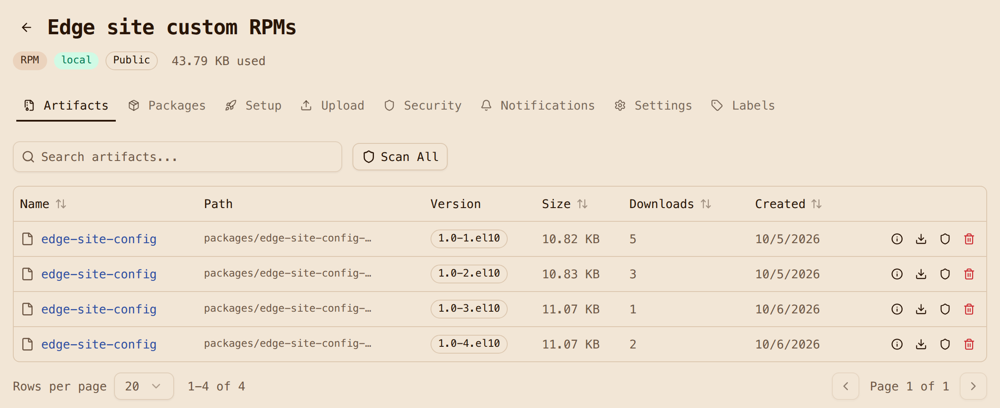
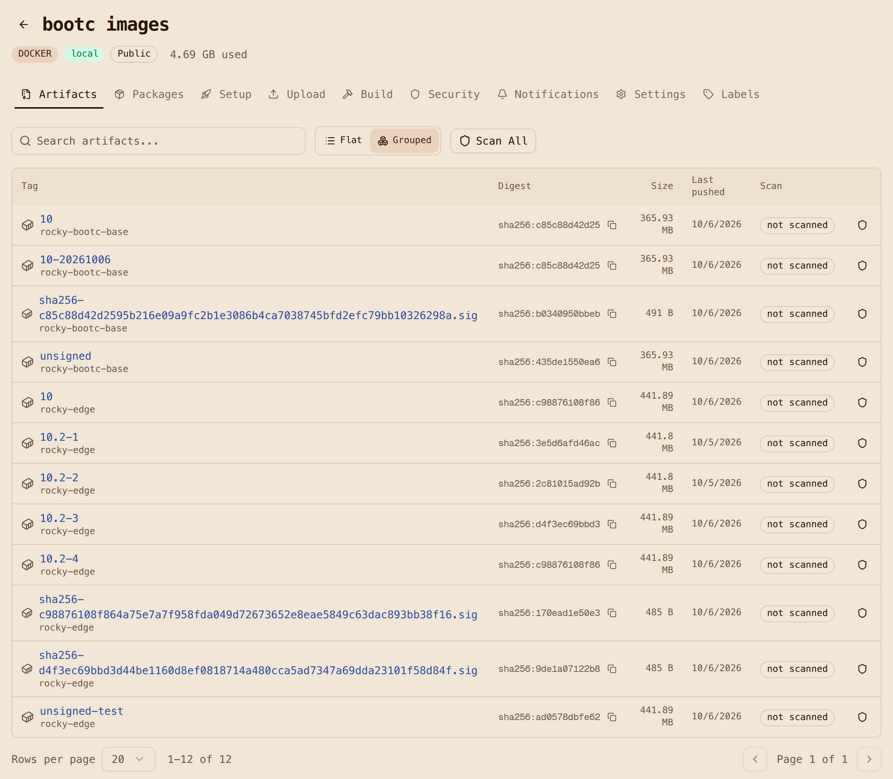

# Step 3: Add Kubernetes and site configuration

This page layers Kubernetes and your site configuration on top of the base image from
[Step 2](2-build-the-base-image.md), with every package coming from the same registry, and
pushes the result as the edge image nodes will install.

**Make targets:** `make rpm` builds and uploads the site configuration package,
`make image` builds the edge image, and `make push` pushes it. The Containerfile is
[`image/Containerfile`](https://github.com/artifact-keeper/walkthroughs/blob/main/rocky-linux-image-mode-bare-metal/image/Containerfile).

## Why RKE2

The edge image is a normal Containerfile that starts `FROM` the base in Artifact Keeper. For
Kubernetes the proof of concept uses RKE2 over k3s for one practical reason: **RKE2 ships real
EL10 RPMs** on `rpm.rancher.io`, both `rke2-server` and `rke2-selinux`, and k3s has no RPM
at all. With RPMs, the Kubernetes distribution flows through the same RPM proxy type as the
operating system, which is the whole point of this exercise. The registry proxies the
`stable/1.36` tree, which is the version the RKE2 stable channel pointed at when the proof of
concept was built.

## Tags

Tags follow one rule: `rocky-edge:<Rocky minor>-<site-config release>`. So `10.2-4` means
Rocky 10.2 plus `edge-site-config` release 4. You build two releases of the site
configuration so that there is something to ship on day 2. The ones you will see in this
walkthrough are 3 and 4. Releases 1 and 2 were an unsigned dry run, and they stay in the
registry for a reason explained in [Step 6](6-sign-and-verify.md).

## The edge Containerfile

```dockerfile title="image/Containerfile (abridged)" hl_lines="4-5 12-13 21-24 28-30 36-41 43"
ARG BASE_IMAGE=localhost:30080/oci-bootc/rocky-bootc-base:10
FROM ${BASE_IMAGE}

COPY build.repo /tmp/build-repos/build.repo
COPY edge.repo /tmp/edge.repo

# Layer 1: OS additions + RKE2. Unchanged across site-config releases.
RUN set -eux; \
    rm -f /etc/yum.repos.d/*.repo; \
    install -m 0644 /tmp/edge.repo /etc/yum.repos.d/edge.repo; \
    kver="$(rpm -q --qf '%{VERSION}-%{RELEASE}' kernel)"; \
    dnf -y --setopt=reposdir=/tmp/build-repos --setopt=install_weak_deps=False install \
        NetworkManager openssh-server bubblewrap "kernel-modules-extra-${kver}" rke2-server rke2-selinux; \
    systemctl enable NetworkManager.service sshd.service rke2-server.service; \
    rm -rf /run/k3s; \
    dnf clean all; rm -rf /tmp/edge.repo /var/cache/dnf /var/lib/dnf /var/log/dnf*.log

# Layer 2: the site configuration RPM (the only thing that changes on day 2).
ARG SITE_RELEASE=1
ARG SITE_VERSION=1.0
RUN set -eux; \
    dnf -y --setopt=reposdir=/tmp/build-repos --setopt=install_weak_deps=False install \
        "edge-site-config-${SITE_VERSION}-${SITE_RELEASE}.el10"; \
    systemctl enable edge-site-manifests.service; \
    dnf clean all; rm -rf /tmp/build-repos /var/cache/dnf /var/lib/dnf /var/log/dnf*.log

# /opt -> var/opt, so RKE2's network plugin can write /opt/cni at runtime.
RUN set -eux; \
    test -z "$(ls -A /opt)"; \
    rm -rf /opt; ln -s var/opt /opt

# Kernel arguments, tmpfiles.d entries, and (from Step 6) the signature policy and key.
COPY rootfs/ /

# Fail the build if any repository or key URL is not Artifact Keeper, or gpgcheck=0.
RUN set -eu; \
    bad="$(grep -rhE '^[[:space:]]*(baseurl|mirrorlist|metalink|gpgkey)[[:space:]]*=' /etc/yum.repos.d/ \
           | sed 's/^[^=]*=//' | tr ' ,' '\n\n' | grep -E '^[a-z]+://' \
           | grep -v -e ':30080/' -e '^file:///etc/pki/rpm-gpg/' || true)"; \
    if grep -rqE '^gpgcheck[[:space:]]*=[[:space:]]*0' /etc/yum.repos.d/; then echo "gpgcheck=0 found" >&2; exit 1; fi; \
    if [ -n "$bad" ]; then echo "non-Artifact-Keeper repo URL(s): $bad" >&2; exit 1; fi

RUN bootc container lint --fatal-warnings
```

`image/build.sh` passes `SITE_RELEASE=3` and `SITE_RELEASE=4` to build the two releases.
Three things in here are on purpose:

- **Two views of the same registry.** The build runs with `build.repo`, where the host is
  `host.containers.internal:30080`, but the image ships `edge.repo`, where the host is
  `10.0.2.2:30080`, which is the address a node sees on the test network (QEMU's user-mode
  networking). Same repositories, different hostname. The
  [architecture page](architecture.md#two-views-of-the-same-registry) explains why this
  matters once signatures come into the picture.
- **The repository check is a build gate.** The base image carries Rocky's stock
  `rocky*.repo` files with mirrorlist URLs. The first `RUN` deletes them, and the gate near
  the end greps for any `baseurl`, `mirrorlist`, `metalink` or `gpgkey` URL that does not
  point at Artifact Keeper. If someone adds a stray upstream URL later, the build fails instead
  of quietly pulling from the internet. The gate also fails on `gpgcheck=0`, which
  [Step 6](6-sign-and-verify.md) relies on.
- **Layer order is a day-2 optimization.** The first version of this image installed RKE2 and
  the site RPM in one `RUN`, so bumping the site configuration changed a 72 MB layer. Split in
  two, a site configuration release changes three small layers that add up to about 8 MB. That
  is the download every edge node pays for a configuration change, so it is worth getting
  right.

Two smaller fixes are in the [image build notes](findings-image.md): pinning
`kernel-modules-extra` to the base kernel, and declaring RKE2's `/var` directories in
tmpfiles.d so that `bootc container lint` passes with warnings treated as errors.

## Image-mode lesson: a read-only /opt

This one only shows up on a booted node. The first install came up with RKE2 active and every
pod stuck in Pending. The cause was canal (RKE2's default network plugin) failing with
`mkdir /opt/cni: read-only file system`. The RESF base keeps `/opt` on the read-only image on
purpose, and the recipe points `/usr/local` at `/var/usrlocal` but leaves `/opt` alone. No
RKE2 package ships anything under `/opt`; only the network plugin writes there, and only at
runtime. Neither `podman run` nor `bootc container lint` can catch this, because nothing is
read-only inside a container build.

The fix is the classic ostree layout: the `/opt` symlink highlighted above, plus a
tmpfiles.d entry for `/var/opt/cni/bin`. The image build checks for that symlink in its smoke
test, so it cannot regress without someone noticing. The symptom and fix are also in
[Troubleshooting](troubleshooting.md#rke2-never-ready-mkdir-optcni-read-only-file-system).

## The site configuration RPM

The `edge-site-config` RPM itself is small, which is how site configuration should be. It
carries RKE2's `config.yaml` and `registries.yaml`, a MOTD that shows the package release so
you can see day 2 land, an insecure-registry drop-in for the plain-HTTP registry, and a demo
nginx Deployment that gets seeded into RKE2's auto-deploy directory on every boot. Its
[full contents](architecture.md#images-layers-and-tags) are on the Architecture page, and
the sources are in
[`rpms/edge-site-config/`](https://github.com/artifact-keeper/walkthroughs/tree/main/rocky-linux-image-mode-bare-metal/rpms/edge-site-config).

The `registries.yaml` is the piece that ties the workloads back to the registry. Artifact
Keeper serves its Docker Hub proxy under a path prefix, and containerd mirrors are host-level,
so RKE2's `rewrite` adds the prefix:

```yaml title="/etc/rancher/rke2/registries.yaml"
mirrors:
  docker.io:
    endpoint:
      - "http://10.0.2.2:30080"
    rewrite:
      "^(.*)$": "oci-dockerhub-proxy/$1"
```

With this, `docker.io/library/nginx:alpine` becomes a request for
`/v2/oci-dockerhub-proxy/library/nginx/manifests/alpine`. Because it mirrors all of
`docker.io`, RKE2's own system images such as `rancher/rke2-runtime` come through the
registry as well. containerd keeps the public endpoint as a fallback, so a real site should
also block egress.

Building the RPM is `rpmbuild` in a `rockylinux:10` container (pulled through the quay.io
proxy again, with dnf pointed only at Artifact Keeper again), and it takes about five seconds
per release. Uploading is one `PUT` per file, as shown in
[Step 1](1-stand-up-artifact-keeper.md#upload-an-rpm).

!!! warning "Uploads are write-once"
    If you re-upload a file name that already exists, Artifact Keeper returns **HTTP 409** and
    keeps the stored file, even if your local bytes are different. Treat each
    name-version-release as immutable and bump the release. That is good practice anyway.



## Build, push and tag

The final numbers for the edge image are 76 layers and 463 MB compressed, with a dozen packages
added on top of the base. The edge build takes under half a minute cold and 8 seconds for a
site-configuration bump. Pushes take a few seconds, because the 68 base layers are already in
`oci-bootc`. `make push` pushes `rocky-edge:10.2-3` and `rocky-edge:10.2-4` as immutable
tags and points the floating `rocky-edge:10` at the first one with a registry-side
`skopeo copy`. Promotion is just moving that tag, which is the subject of
[Step 5](5-upgrade-and-roll-back.md).



!!! warning "`make push` re-points `:10`"
    `make push` always moves `:10` to `REL` (default 3). Running it after a day-2 promote
    moves the fleet's tag back. Use `make promote REL=N` to move the tag deliberately.

**Next:** [Step 4: Install on bare metal with a kickstart](4-install-with-a-kickstart.md).
