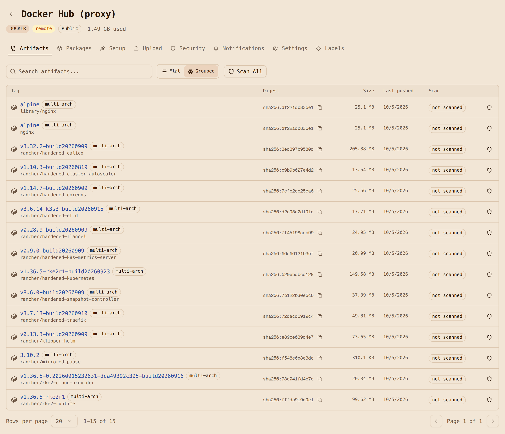

# Step 4: Install on bare metal with a kickstart

With the edge image from [Step 3](3-add-kubernetes-and-site-config.md) in the registry, this
page installs it on a node and checks that everything the node runs came from Artifact Keeper.

**Make targets:** `make vm-install`, `make vm-boot` and `make vm-verify`. The kickstart
template is [`deploy/ks.cfg.in`](https://github.com/artifact-keeper/walkthroughs/blob/main/rocky-linux-image-mode-bare-metal/deploy/ks.cfg.in), rendered by
[`deploy/render-ks.sh`](https://github.com/artifact-keeper/walkthroughs/blob/main/rocky-linux-image-mode-bare-metal/deploy/render-ks.sh).

## Netboot the stock installer

Deploying a node works the way Enterprise Linux installs have worked for a long time:
network-boot the stock installer and hand it a kickstart. There is no custom ISO, no disk image
to copy around, and no `bootc-image-builder`. The installer (Anaconda) in Rocky 10.2 knows how
to pull a bootc image and deploy it as the payload.

The harness boots the installer's own `vmlinuz` and `initrd.img` from the Rocky 10.2
mirror's `images/pxeboot/` directory, and serves the kickstart and a cached copy of the
installer's stage2 over HTTP. In a real rack that is a PXE server and a DHCP option. In the
proof of concept it is a small HTTP server next to the VM.

## The kickstart

The kickstart is the interesting part. This is the template rendered with its defaults,
abridged: [Step 6](6-sign-and-verify.md) adds the signature policy to `%pre`, and the
real file has a few more `%post` lines for it.

```text title="deploy/ks.cfg.in (rendered, abridged)" hl_lines="13-21 23 26"
text
lang en_US.UTF-8
keyboard us
timezone UTC --utc
network --bootproto=dhcp --device=link --activate --hostname=edge-node-01

zerombr
clearpart --all --initlabel --disklabel=gpt
reqpart --add-boot
part / --grow --fstype=xfs

# The registry is plain HTTP (PoC). Anaconda honors registries.conf.
%pre --erroronfail --log=/tmp/ks-pre.log
mkdir -p /etc/containers/registries.conf.d
cat > /etc/containers/registries.conf.d/50-poc-insecure.conf <<'EOR'
[[registry]]
location = "10.0.2.2:30080"
insecure = true
EOR
# Step 6: fetch the public key and write the signature policy here.
%end

ostreecontainer --url=10.0.2.2:30080/oci-bootc/rocky-edge:10 --transport=registry

rootpw --lock
sshkey --username=root "ssh-ed25519 AAAA..."

%post --log=/root/ks-post.log
# Same drop-in on the installed system, so bootc upgrade can reach the registry.
mkdir -p /etc/containers/registries.conf.d
cat > /etc/containers/registries.conf.d/50-poc-insecure.conf <<'EOR'
[[registry]]
location = "10.0.2.2:30080"
insecure = true
EOR
%end

reboot
```

Notice there is no `%packages` section. The image is the package list. The only per-node
inputs are the hostname and the operator's SSH key, and the installer never asks anyone to type
a password. The [kickstart flow](architecture.md#kickstart-flow) on the Architecture page
shows every step in order.

## Two lessons from this step

**Use `ostreecontainer`, not the newer `bootc` kickstart command.** Both commands validate on
Rocky 10.2, and the `bootc` command (which runs `bootc install to-filesystem` under the hood)
is where the installer is headed. When we tried it on Rocky 10.2, the installed system had the
wrong SELinux labels on the root SSH key and on `/etc/resolv.conf`. sshd could not read the key
and NetworkManager could not write DNS, so the node was unreachable, and a `restorecon` in
`%post` did not fix it. The same image installed with `ostreecontainer` (which runs
`ostree container image deploy`) came up correctly labeled with SELinux enforcing. We did not
chase the root cause any further. The lesson for a fleet is that you have to test the install
path, not just the image. The symptoms are in
[Troubleshooting](troubleshooting.md#avc-denials-on-first-boot-bootc-kickstart-command).

**Mark the registry insecure in both places.** Anaconda pulls the image inside the installer
environment, so the `registries.conf.d` drop-in has to exist there (that is the `%pre`). The
installed system needs the same drop-in for `bootc upgrade`, so the `edge-site-config` RPM
bakes it into the image, and the kickstart writes it into the installed `/etc` as well. In
production you would terminate TLS at Artifact Keeper's Caddy front door and distribute the CA
instead; see [Next steps](next-steps.md#turn-on-tls). The mechanics are the same.

## Power on

Here is what happens on power-on, with KVM:

| Milestone | Time |
|---|---|
| Installer boots, applies the kickstart, pulls and deploys the image, reboots | 65 s |
| SSH answers on the installed system | 25 s after first boot |
| RKE2 node Ready | 61 s after SSH |
| Demo workload Running | shortly after |

## Verify the node

`make vm-verify` runs a verification script over SSH. This is the output that made the whole
exercise feel worth it:

```text title="make vm-verify (abridged)"
=== bootc status ===
spec:    image: 10.0.2.2:30080/oci-bootc/rocky-edge:10   transport: registry
booted:  version: 10.2-3   imageDigest: sha256:d4f3ec69bbd3...
=== getenforce ===
Enforcing
=== kubectl get nodes -o wide ===
NAME           STATUS   ROLES                VERSION          OS-IMAGE                        KERNEL-VERSION
edge-node-01   Ready    control-plane,etcd   v1.36.5+rke2r1   Rocky Linux 10.2 (Red Quartz)   6.12.0-211.61.1.el10_2.x86_64
=== workload image / imageID ===
default/nginx-demo-...  docker.io/library/nginx:alpine  docker.io/library/nginx@sha256:df221db8...
=== Artifact Keeper: oci-dockerhub-proxy ===
98 cached objects; images: library/nginx, rancher/hardened-calico, rancher/hardened-coredns,
  rancher/hardened-etcd, rancher/hardened-kubernetes, rancher/klipper-helm, rancher/rke2-runtime, ...
OK: nginx-demo runs nginx:alpine @ sha256:df221db8..., and that manifest is cached in oci-dockerhub-proxy
```

Every image the cluster pulled, from `rancher/hardened-calico` to the demo's `nginx:alpine`,
is now cached in `oci-dockerhub-proxy`. You can see it in the Artifact Keeper UI right next to
the RPMs and the operating system image that produced the node.



!!! note "If it fails"
    `vm-install` refuses to start while a VM is running; `make vm-clean vm-all` starts from a
    fresh disk. A timeout is covered in
    [Troubleshooting](troubleshooting.md#vm-install-times-out), and the full install log
    is in the [deploy notes](findings-deploy.md).

**Next:** [Step 5: Upgrade and roll back by moving a tag](5-upgrade-and-roll-back.md).
