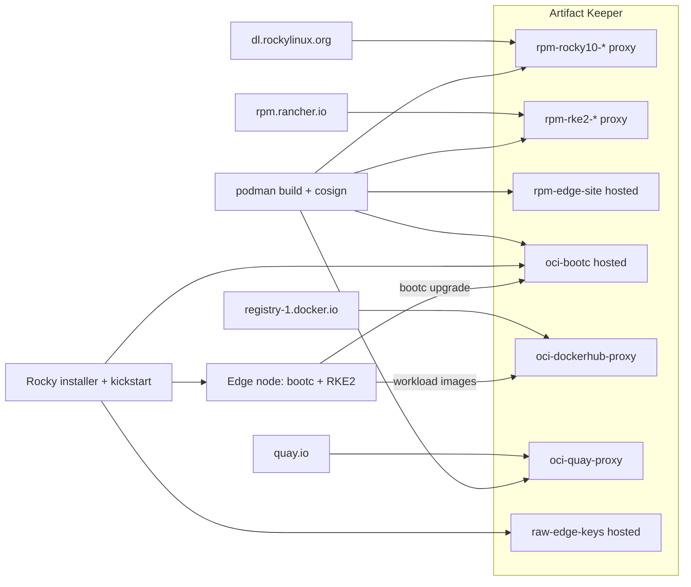

---
tags:
  - Rocky Linux
  - image mode
  - bare metal
  - Kubernetes
  - OCI
  - RPM
  - signing
  - upgrades and rollback
description: >-
  Deploy Rocky Linux image mode to bare metal with Artifact Keeper as the single source of
  truth for RPMs, signed bootc images, keys and Kubernetes workloads.
---

# Rocky Linux image mode on bare metal

Every box in an edge fleet should be running the same operating system, the same Kubernetes,
and the same site configuration, and you should be able to prove it. That is harder than it
sounds. With a package-based install, two machines start to drift the first time someone runs
`dnf update` on one of them and not the other. Image mode fixes this at the operating system
layer. With [bootc](https://bootc-dev.github.io/bootc/) (a tool that boots and updates a Linux
system from a container image), the whole operating system is built with a Containerfile,
nodes boot it, and upgrading means pointing them at a new image. Rocky Linux image mode is this
idea on Rocky Linux.

An image is only as trustworthy as where it came from, though. In a typical setup the base RPMs
come from a public mirror, the Kubernetes packages come from a vendor repository, your own
configuration comes from a tarball on someone's laptop, and the final image sits in yet another
registry. That is four sources of truth. When something goes wrong on node 37, nobody can say
for sure what is running on it.

This walkthrough puts all of that in one place.
[Artifact Keeper](https://github.com/artifact-keeper/artifact-keeper) (an open-source universal
artifact registry) holds every byte a node boots from.

## What you will build

- Rocky Linux 10 BaseOS, AppStream, extras and EPEL, as **RPM proxy repositories**
- RKE2 (Rancher's Kubernetes distribution) packages, as another **RPM proxy**
- an `edge-site-config` package of your own, in a **hosted RPM repository**
- a Rocky bootc base image you build yourself, and the edge image built on top of it, in a
  **hosted OCI registry**
- the container images the cluster runs, through **OCI proxies** for Docker Hub and quay.io
- the public keys everything is verified against, in a **hosted generic repository**

A node boots the stock Rocky installer with a kickstart file (the answer file the Enterprise
Linux installer reads so nobody has to type anything), pulls the edge image from Artifact
Keeper, and comes up running RKE2. Upgrades are a `bootc upgrade` against the same registry,
and every RPM and image is signed and checked on the way in.

Everything here comes from a working proof of concept, and all of its code lives next to this
walkthrough in
[`rocky-linux-image-mode-bare-metal/`](https://github.com/artifact-keeper/walkthroughs/tree/main/rocky-linux-image-mode-bare-metal) in this repository. The
[Reference](reference/make-targets.md) pages describe every script and make target, and the
[Lab notes](findings.md) record what broke along the way. The "bare metal" here is a QEMU
virtual machine so that anyone can run it, and nothing in the pipeline knows the difference.

## Architecture



The build host pulls packages and the builder image through Artifact Keeper and pushes signed
images back into it. The installer and the node read only from Artifact Keeper. The
[Architecture](architecture.md) page has the full version of this diagram.

These are the repositories you create in [Step 1](1-stand-up-artifact-keeper.md). All of them
are public so that edge nodes do not need credentials to read:

| Repository | Format | Type | Upstream or contents |
|---|---|---|---|
| `rpm-rocky10-baseos`, `-appstream`, `-extras` | RPM | proxy | dl.rockylinux.org, Rocky 10 |
| `rpm-epel10` | RPM | proxy | dl.fedoraproject.org, EPEL 10 |
| `rpm-rke2-common`, `rpm-rke2-1.36` | RPM | proxy | rpm.rancher.io, RKE2 EL10 packages |
| `rpm-k3s` | RPM | proxy | rpm.rancher.io, k3s SELinux policy only; kept for a k3s fallback |
| `rpm-edge-site` | RPM | hosted | the `edge-site-config` package |
| `oci-bootc` | OCI | hosted | base and edge bootc images, and their signatures |
| `oci-quay-proxy`, `oci-dockerhub-proxy` | OCI | proxy | quay.io, registry-1.docker.io |
| `raw-edge-keys` | generic | hosted | public keys (used from Step 6 on) |

## Prerequisites

- A Linux host with rootless podman, skopeo, cosign, gpg, jq, curl, python3, QEMU and OVMF
  firmware. The proof of concept was developed on Fedora 44. The
  [Environment setup](environment.md) page
  lists the exact packages, tested versions and the two host settings that may need an
  administrator once (kvm group membership and `vm.max_map_count`).
- About 8 GB of free RAM for the VM plus the Artifact Keeper stack, and about 7 GB of disk for
  images and install media, plus a 40 GB sparse VM disk.
- An SSH key pair. The kickstart injects the public key, and root's password is locked, so that
  key is the only way into the node.
- Internet access from the host, for the proxy repositories' first fetches and the installer
  media.
- `/dev/kvm` is strongly recommended. Everything also runs under QEMU's software emulator,
  about five times slower.

No step needs `sudo`.

## What each page covers

| Page | What you do | What you learn |
|---|---|---|
| [1. Stand up Artifact Keeper](1-stand-up-artifact-keeper.md) | Start the registry, create the repositories, upload an RPM | The three settings everything else depends on |
| [2. Build a Rocky Linux image mode base](2-build-the-base-image.md) | Compose the bootc base from the RESF recipe with every RPM from Artifact Keeper | Why to build the base yourself, and why `minimal` |
| [3. Add Kubernetes and site configuration](3-add-kubernetes-and-site-config.md) | Layer RKE2 and a site RPM on the base, with a build gate | The read-only `/opt` lesson, layer order for day 2 |
| [4. Install on bare metal with a kickstart](4-install-with-a-kickstart.md) | Netboot the stock installer and deploy the image | `ostreecontainer` over `bootc`, and what a node pulls |
| [5. Upgrade and roll back by moving a tag](5-upgrade-and-roll-back.md) | Promote a release in the registry, `bootc upgrade`, `bootc rollback` | The missing `bubblewrap` lesson |
| [6. Sign everything and verify everywhere](6-sign-and-verify.md) | Sign RPMs, repodata and images; enforce with `policy.json` | The cosign format problem, and what actually enforces signatures |
| [Results](results.md) | | Timings and the verification output |
| [Next steps](next-steps.md) | | TLS, one DNS name, digest pinning, PXE, egress |

## Time to complete

- **Reading:** about 30 minutes.
- **Running it, with KVM:** about 15 to 20 minutes of machine time. A cold `make all` takes
  roughly 6 to 8 minutes, most of it the base image build, and `make vm-all` (install, boot,
  verify, upgrade, rollback) a little under 10 minutes, plus a one-time 750 MB installer
  download.
- **Without KVM:** plan on an hour or more. Power-on to a working cluster alone is about
  17 minutes under software emulation, against about 3 minutes with KVM.

The stage-by-stage numbers are on the [Results](results.md) page.

!!! tip "Run it yourself"

    Every step in this walkthrough is a `make` target in
    [`rocky-linux-image-mode-bare-metal/`](https://github.com/artifact-keeper/walkthroughs/tree/main/rocky-linux-image-mode-bare-metal). To run the whole thing
    end to end:

    ```console
    $ git clone https://github.com/artifact-keeper/walkthroughs
    $ cd walkthroughs/rocky-linux-image-mode-bare-metal
    $ make preflight
    $ make all
    $ make vm-all
    ```

    `make preflight` checks the tools, rootless podman, `/dev/kvm`, `vm.max_map_count`, the SSH
    key and the ports. `make all` is `registry-up keys publish-keys base rpm image push
    unsigned-test sign verify`: everything up to signed, verified edge images. `make vm-all`
    walks a node through install, verification, a refused unsigned upgrade, a real upgrade,
    and rollback. Each page of this walkthrough names the targets it corresponds to, and the
    [make-target reference](reference/make-targets.md)
    describes each one. The full pipeline is in the
    [`Makefile`](https://github.com/artifact-keeper/walkthroughs/blob/main/rocky-linux-image-mode-bare-metal/Makefile).
